# LMM - Large Multimodal Model

대규모 멀티모달 모델의 이해와 적용

---
layout: table-of-contents
hideInToc: true
---

---
layout: section
hideInToc: false
---

# Part 1 — Large Language Model

LLM의 개념과 Transformer

---

# LLM이란

LLM(Large Language Model)은 텍스트를 입력받아 텍스트를 출력하는 대규모 언어 모델입니다.

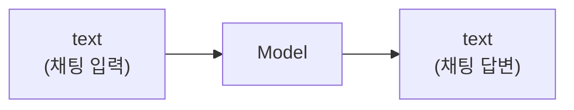

<v-clicks>

- 채팅 입력 (프롬프트)을 받아서
- 모델이 처리한 뒤
- 채팅 답변 (응답)을 생성

</v-clicks>

---

# "Large"의 의미

모델의 **파라미터 수**가 많다는 것을 의미합니다.

<div class="grid grid-cols-2 gap-8">

<div>

### gpt-oss 모델

| Name | Size |
| --- | --- |
| gpt-oss:20b | 14GB |
| gpt-oss:120b | 65GB |

</div>

<div>

### llama3.1 모델

| Name | Size |
| --- | --- |
| llama3.1:8b | 4.9GB |
| llama3.1:70b | 43GB |
| llama3.1:405b | 243GB |

</div>

</div>

<v-click>

- 8b = **80억개** 파라미터
- 70b = **700억개** 파라미터
- 405b = **4,050억개** 파라미터

</v-click>

---

# Transformer 아키텍처

현재 대부분의 LLM은 **Transformer**에 기반을 두고 있습니다.

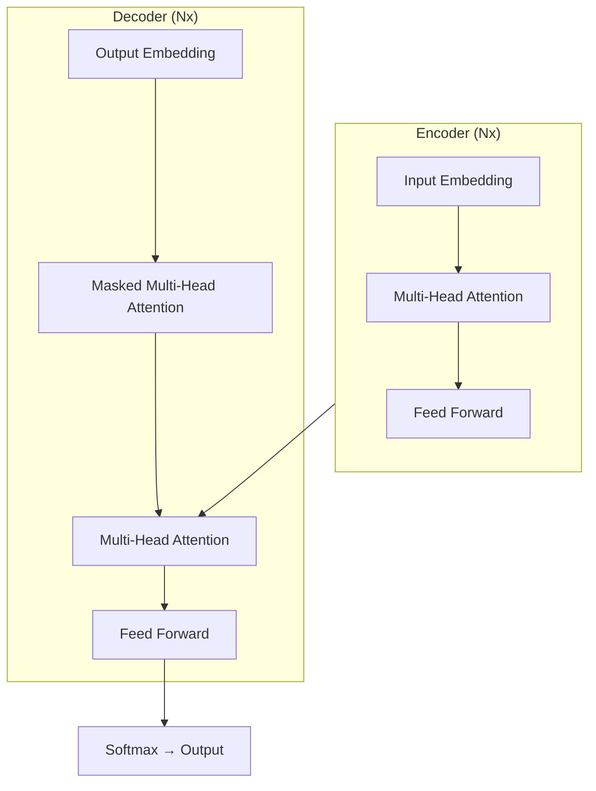

<v-clicks>

- **Attention**: 토큰 간 관계를 학습 (핵심!)
- 텍스트뿐 아니라 **관계를 나타내는 모든 데이터**에 적용 가능
- 파라미터 수가 엄청나게 많음 → 많은 학습 데이터 필요

</v-clicks>

---
layout: bullets
---

# Local LLM

- **Ollama** — https://ollama.com/
- **LM Studio** — https://lmstudio.ai/
- **exo** — https://github.com/exo-explore/exo

<v-click>

> **중요**: 로컬에서는 **추론(inference)** 만 실행합니다.
> 학습(training)은 GPU 클러스터가 필요합니다.

</v-click>

---
layout: section
hideInToc: false
---

# Part 2 — Multimodal Model

텍스트를 넘어 이미지, 오디오, 비디오로

---

# LLM에서 LMM으로

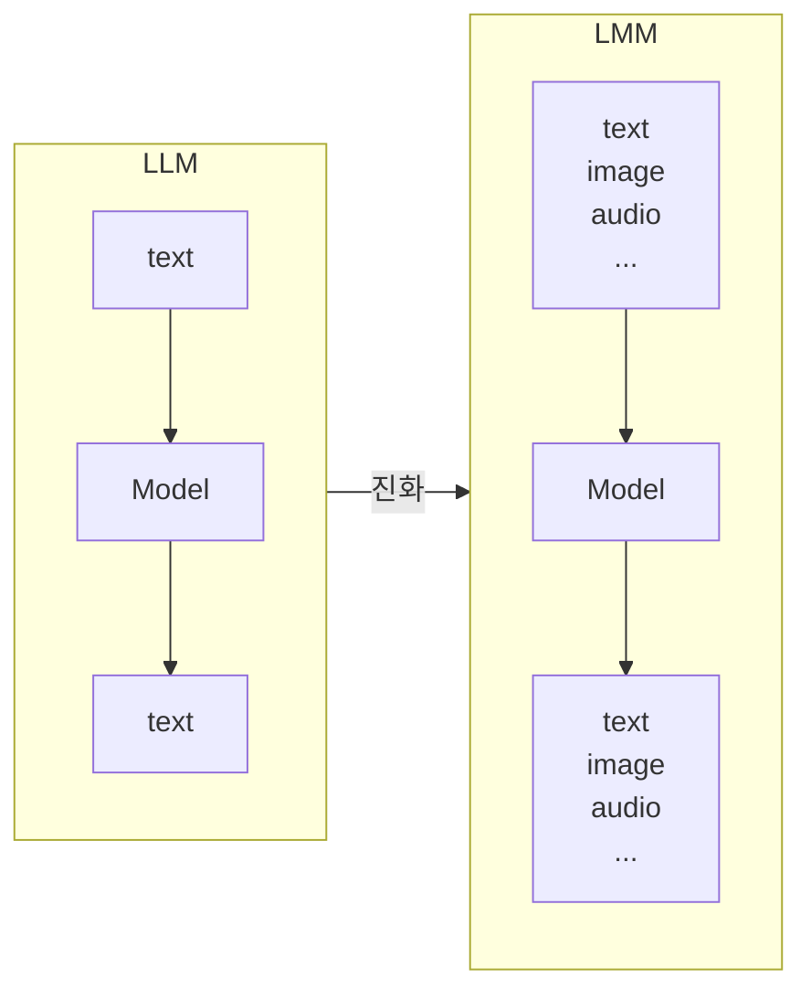

<v-click>

멀티모달 데이터는 텍스트, 이미지, 음성 등 **여러 형태의 데이터**를 포함하며,
이를 통합하여 처리함으로써 더 풍부한 정보를 얻을 수 있습니다.

</v-click>

---
layout: cols
---

# 복잡한 이미지 해석 예시

::left::

### 이미지만 입력

> "번화한 도시 거리에 여러 사람들이 걸어가고 있고, 자동차들이 도로를 지나가고 있습니다."

→ 표면적 묘사

::right::

<v-click>

### 이미지 + 텍스트 질문

> 질문: "교통 표지판의 종류와 위치를 설명해주세요."

> "총 3개의 교통 표지판이 있습니다. 오른쪽 상단에 빨간색 정지 표지판..."

→ **의도에 맞는 심층 분석**

</v-click>

---

# 멀티모달 모델 아키텍처

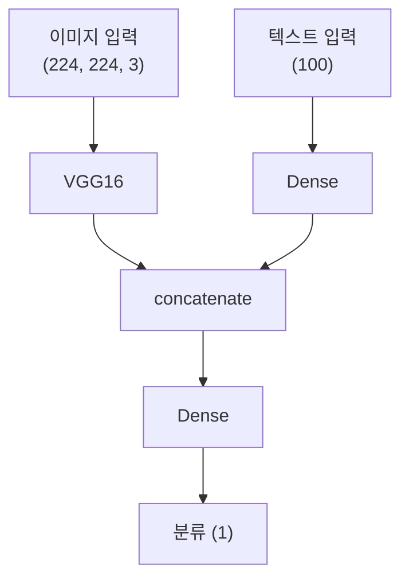

| 접근 | 설명 |
| --- | --- |
| 이미지만 | 이미지에 대해서만 학습 |
| 텍스트만 | 텍스트에 대해서만 학습 |
| **멀티모달** | **둘 다에 맞춰 학습 → 더 풍부한 맥락** |

---

# 데이터 융합 방식

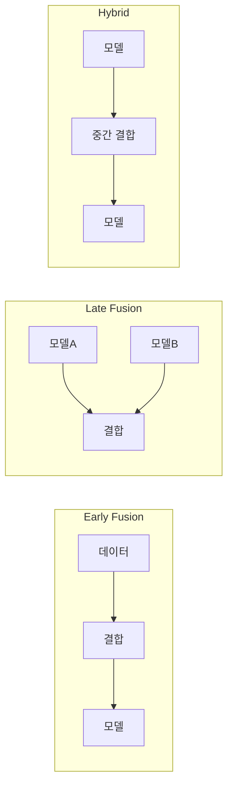

| 방식 | 장점 | 단점 |
| --- | --- | --- |
| Early | 초기 상호작용 반영 | 차원 증가 |
| Late | 독립적 특성 반영 | 상호작용 부족 |
| Hybrid | 양쪽 장점 결합 | 설계 복잡 |

---
layout: section
hideInToc: false
---

# Part 3 — Transformer

Self-Attention과 Cross-Attention

---

# Attention 메커니즘

Transformer의 핵심은 **Attention**입니다.

- **Self-Attention**: 같은 시퀀스 내 토큰 간 관계
- **Cross-Attention**: 서로 다른 시퀀스 간 관계

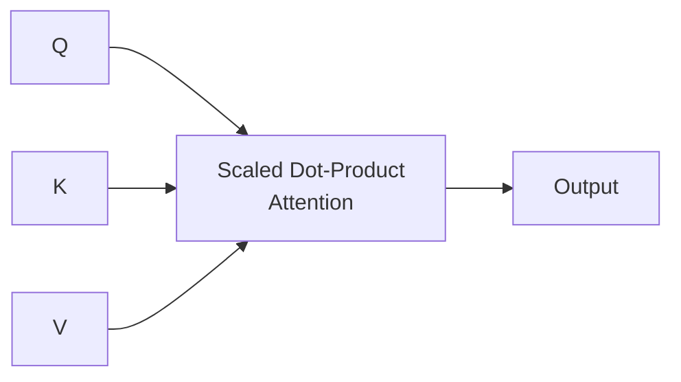

<v-click>

$$\text{Attention}(Q, K, V) = \text{softmax}\left(\frac{QK^T}{\sqrt{d_k}}\right)V$$

</v-click>

---
layout: cols
---

# 텍스트 vs 이미지 Attention

::left::

### 텍스트

```
한국어: 8개 토큰
영어:   9개 토큰
```

8 x 9 = **72가지** 관계

::right::

<v-click>

### 이미지 (256x256)

```
입력: 65,536 픽셀
출력: 65,536 픽셀
```

65,536 x 65,536 = **약 42억개**

</v-click>

<v-click>

<div class="mt-4 p-4 bg-red-50 rounded text-center text-xl">

텍스트 **72개** vs 이미지 **42억개**

</div>

**해결**: subsampling + convolution → Self-Attention

</v-click>

---
layout: fact
---

# Dense vs Conv vs Attention

<div class="text-base mt-8">

| 레이어 | 연결 범위 | 핵심 차이 |
| --- | --- | --- |
| **Dense** | 모든 입력 → 모든 출력 | 위치 무관 |
| **Conv** | 주변 N개 → 출력 | 사용자가 범위 **가정** |
| **Attention** | 모든 입력 간 관계 | 기계가 범위 **학습** |

</div>

---
layout: section
hideInToc: false
---

# Part 4 — CLIP 모델

이미지-텍스트 유사도

---

# CLIP 개요

**CLIP** (Contrastive Language-Image Pretraining) — OpenAI

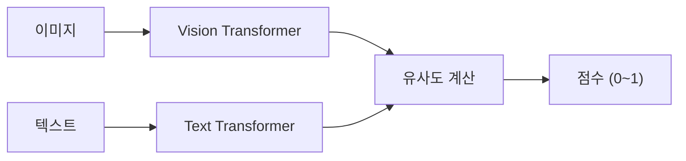

<v-clicks>

- 이미지와 텍스트를 입력 → **유사도 점수** 출력
- 1에 가까울수록 잘 일치
- 파라미터: **약 1.5억개** (151,277,313)

</v-clicks>

---

# CLIP 시연 결과

COCO 데이터셋 Cat 카테고리:

| 텍스트 | 유사도 점수 |
| --- | --- |
| '동물 사진' | 0.1865 |
| '강아지가 앉아있는 모습' | 0.0435 |
| '고양이가 앉아있는 모습' | 0.0290 |
| **'고양이 사진'** | **0.7410** |

<v-click>

> "고양이 사진"이 **0.74**로 가장 높은 유사도!
> CLIP이 이미지-텍스트 관계를 잘 학습했음을 보여줍니다.

</v-click>

---
layout: cols
---

# 대조 학습 (Contrastive Learning)

::left::

### 관련 쌍 → 유사도 높이기

```
🐱 고양이 사진 + "고양이"
→ 높은 점수 ✅
```

### 비관련 쌍 → 유사도 낮추기

```
🐱 고양이 사진 + "자동차"
→ 낮은 점수 ❌
```

::right::

<v-click>

### SigLIP 2 (2025)

| 비교 | CLIP | SigLIP 2 |
| --- | --- | --- |
| 손실 함수 | Softmax | **Sigmoid** |
| 학습 | 대조만 | 대조+captioning |
| 적용 | - | **Drop-in** |

CLIP의 후속 표준

</v-click>

---
layout: section
hideInToc: false
---

# Part 5 — BLIP-2 모델

Q-Former와 효율적 학습

---

# BLIP-2 아키텍처

Salesforce (2023) — **Q-Former**로 시각-언어 연결

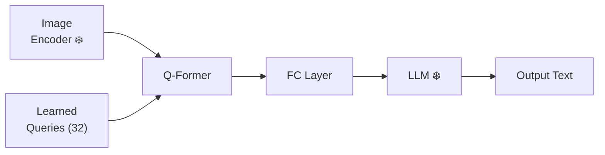

<v-clicks>

- **❄️ = Frozen** (학습하지 않음)
- Q-Former + FC Layer만 학습
- 전체 **3.2B** 중 **190M만 학습 (6%)**

</v-clicks>

---
layout: cols
---

# 2단계 학습

::left::

### 1단계: Representation

<v-click>

- Image Encoder + Q-Former
- 이미지-텍스트 **정렬** 학습
- 3가지 손실 함수 결합

</v-click>

::right::

<v-click>

### 2단계: Generation

- Q-Former → FC → LLM
- 이미지 기반 텍스트 **생성** 학습
- Q-Former만 fine-tuning

</v-click>

<v-click>

> 먼저 정렬을 배우고, 그 다음 생성을 배우는 게 효율적!

</v-click>

---

# Adapter → Native Multimodal (2025~)

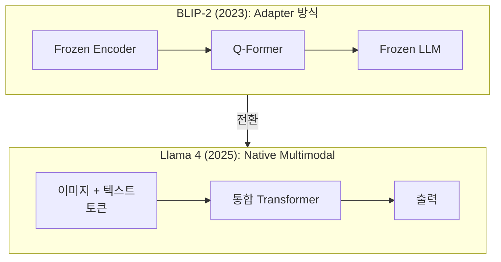

<v-click>

| 모델 | 방식 | 특징 |
| --- | --- | --- |
| BLIP-2 | Adapter | Frozen encoder + Q-Former + Frozen LLM |
| **Llama 4** | Native | MetaCLIP + Early Fusion + MoE |
| **GPT-4o** | Native | 통합 멀티모달 토큰화 |

</v-click>

---
layout: section
hideInToc: false
---

# Part 6 — 이미지 생성

Stable Diffusion과 Autoregressive

---

# Denoising → 이미지 생성

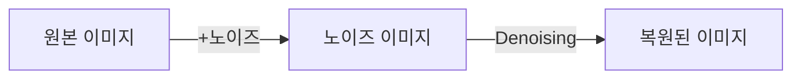

<v-click>

역으로 이용하면?

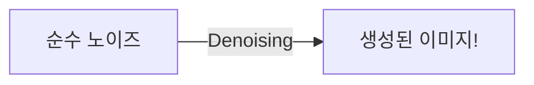

</v-click>

---
layout: img-caption
---

# Stable Diffusion 아키텍처

::img-fit-width::

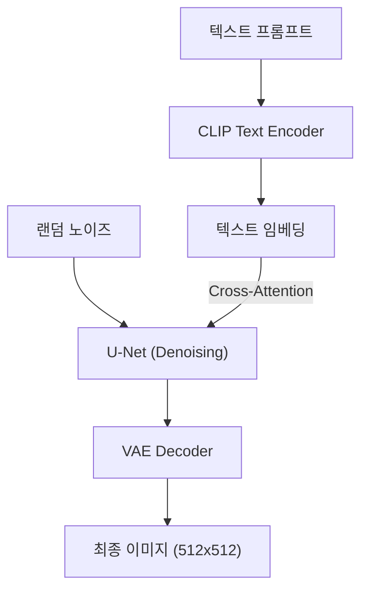

::caption::

VAE(압축) + U-Net(Denoising) + CLIP(텍스트 조건) = Stable Diffusion

---

# Autoregressive 이미지 생성 (2025)

GPT-4o가 **Diffusion 없이** 이미지를 생성!

| 비교 | Diffusion | Autoregressive |
| --- | --- | --- |
| 생성 방식 | 노이즈에서 반복 제거 | 토큰 단위 순차 생성 |
| 텍스트 렌더링 | 부정확 | **정확** (토큰 기반) |
| 멀티턴 편집 | 어려움 | **대화로 수정 가능** |
| LLM 통합 | 별도 모델 | **LLM 내장** |

<v-click>

> **지브리풍 바이럴 (2025.03):** 72시간, 1.3억 사용자, 7억장 생성

</v-click>

---
layout: section
hideInToc: false
---

# Part 7 — 최신 트렌드

MoE, Omni-Modal, 비디오 Grounding

---

# MoE (Mixture of Experts)

기존 모델: 모든 파라미터 사용. MoE: **필요한 Expert만 활성화**

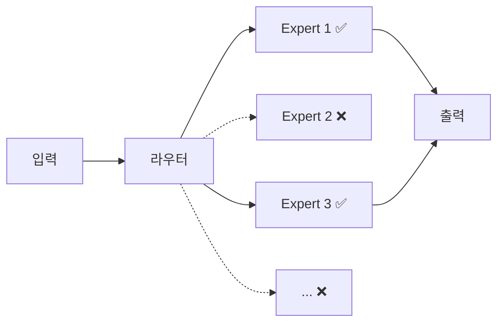

<v-click>

| 항목 | Llama 4 Maverick |
| --- | --- |
| 전체 파라미터 | ~400B |
| 활성 파라미터 | **17B** (약 4.3%) |

</v-click>

---
layout: img-caption
---

# Omni-Modal: Thinker-Talker

::img-fit-width::

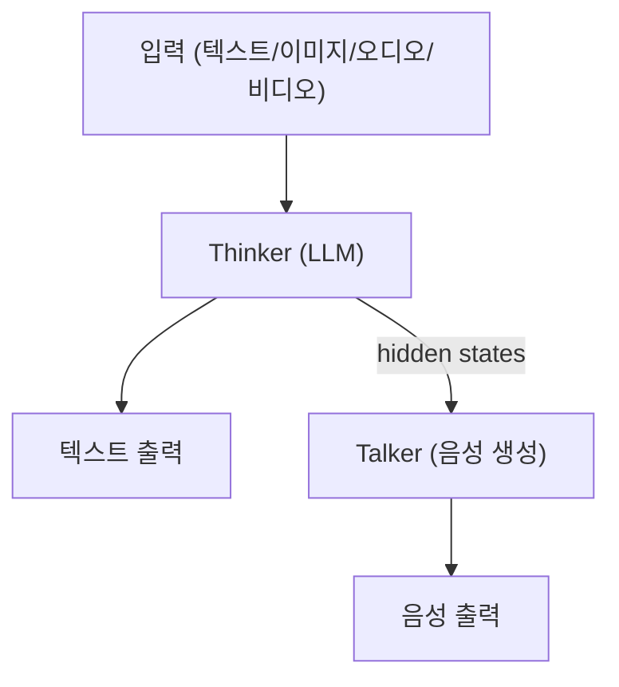

::caption::

**Qwen2.5-Omni:** 텍스트를 생각하면서 동시에 말하는 구조

---
layout: cols
---

# 비디오 이해 + Grounding

::left::

모델이 영상에서 객체의 **정확한 좌표**를 출력:

```
질문: "사람은 어디에?"
→ bbox (x1, y1, x2, y2)
```

::right::

<v-click>

### RTX 3090 (24GB)

| 모델 | VRAM | Grounding |
| --- | --- | --- |
| **Qwen2.5-VL-7B** | ~15GB | bbox |
| Molmo-7B | ~14-16GB | (x,y) |
| Florence-2 | ~2-4GB | bbox+seg |

</v-click>

---
layout: bullets
---

# 윤리와 저작권

- **저작권:** 학습 데이터의 이미지/텍스트 저작권 문제
- **딥페이크:** 사실적인 이미지/영상 생성의 위험
- **편향:** 학습 데이터의 편향이 출력에 반영
- **지브리 사례:** 특정 작가 스타일의 무단 복제

---
layout: section
hideInToc: false
---

# Part 8 — 시연

Qwen2.5-VL 비디오 Grounding

---

# 시연 환경

| 항목 | 구성 |
| --- | --- |
| 모델 | Qwen2.5-VL-7B-Instruct |
| 하드웨어 | RTX 3090 (24GB VRAM) |
| VRAM | FP16 ~15GB |
| 프레임워크 | Transformers + Qwen-VL-Utils |

<v-clicks>

1. **이미지 Grounding** — 이미지 + 질문 → 바운딩박스 좌표
2. **비디오 이해** — 프레임 추출 → 영상 내용 설명
3. **비디오 Grounding** — 프레임별 객체 위치 추적

</v-clicks>

---

# 시연 코드

```python {all|1-2|4-8|10-17|19-23}
from transformers import Qwen2_5_VLForConditionalGeneration, AutoProcessor
from qwen_vl_utils import process_vision_info

# 모델 로드
model = Qwen2_5_VLForConditionalGeneration.from_pretrained(
    "Qwen/Qwen2.5-VL-7B-Instruct",
    torch_dtype=torch.float16, device_map="auto"
)

# 이미지 + 질문
messages = [{
    "role": "user",
    "content": [
        {"type": "image", "image": "photo.jpg"},
        {"type": "text", "text": "사람의 위치를 bbox로 알려주세요."},
    ],
}]

# 추론
text = processor.apply_chat_template(messages, tokenize=False,
                                     add_generation_prompt=True)
inputs = processor(text=[text], images=image_inputs,
                   return_tensors="pt").to("cuda")
output_ids = model.generate(**inputs, max_new_tokens=512)
```

---
layout: section
hideInToc: false
---

# 전체 요약

아키텍처 진화와 핵심 메시지

---

# 아키텍처 진화

| 시기 | 주요 변화 | 대표 모델 |
| --- | --- | --- |
| ~2022 | 비전 인코더 + 대조 학습 | CLIP |
| 2023 | Adapter로 LLM 연결 | BLIP-2 |
| 2024 | Native Multimodal | GPT-4o |
| 2025 | MoE + Omni-Modal + AR 이미지 | Llama 4, Qwen2.5-Omni |

---

# 핵심 메시지

| 파트 | 핵심 |
| --- | --- |
| Part 1 | "Large" = Transformer의 방대한 파라미터 |
| Part 2 | 여러 데이터 통합 → 풍부한 이해 |
| Part 3 | Attention은 모든 관계 데이터에 적용 가능 |
| Part 4-5 | CLIP/BLIP-2 → SigLIP 2 + Native Multimodal |
| Part 6 | Diffusion → Autoregressive로 LLM 통합 |
| Part 7-8 | MoE + Omni-Modal + 비디오 Grounding |

---
layout: index
indexEntries:
  - { title: "강의 상세 자료", uri: "https://courses.codecompose.net/ko/courses/lmm/detail/" }
  - { title: "Ollama", uri: "https://ollama.com" }
  - { title: "Qwen2.5-VL", uri: "https://huggingface.co/Qwen/Qwen2.5-VL-7B-Instruct" }
  - { title: "Qwen2.5-Omni", uri: "https://github.com/QwenLM/Qwen2.5-Omni" }
  - { title: "Llama 4", uri: "https://ai.meta.com/blog/llama-4-multimodal-intelligence/" }
indexRedirectType: external
---

# 참고 자료

---
layout: outro
---

# 감사합니다!

질문이 있으신가요?

[CodeCompose](https://codecompose.dev)
